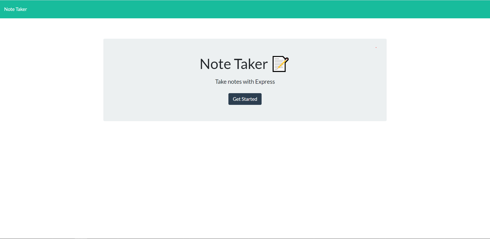
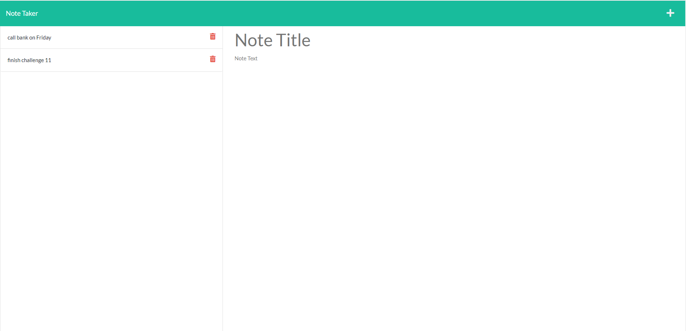

# note-taker

## Description 
This app is built to create note taker that can be used to save and write notes. 
## Table of Contents
- [Instructions](#instructions)
- [Usage Information](#usage-information)
- [Question](#question)
## Instructions
- clone this repository.
- Download Node.js at [https://nodejs.org/en/download/](https://nodejs.org/en/download/)
- Using npm to install required packages by using **npm install**.

## Usage Information
Run `node server.js` in the command line.

## Question
If you have any additional questions about this project, Feel free to reach me at [vantam8300@gmail.com](vantam8300@gmail.com).
For more of my project, please visit [https://github.com/vantam8300](https://github.com/vantam8300)